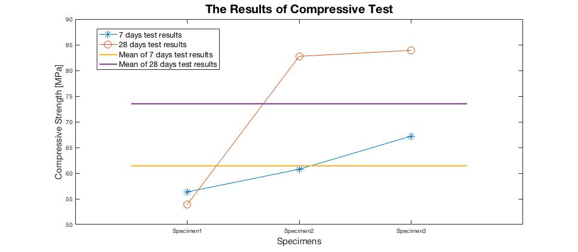

# AdvancedCIVILMaterial512

## Introduction
* This reposotory is created for the graduate level course CIVE512 Advanced  in McGill University. 
* There was a concrete conpetition, then serveral strength tests were conducted, and here the code for plotting can be found.  
. 

## Plotting Result

